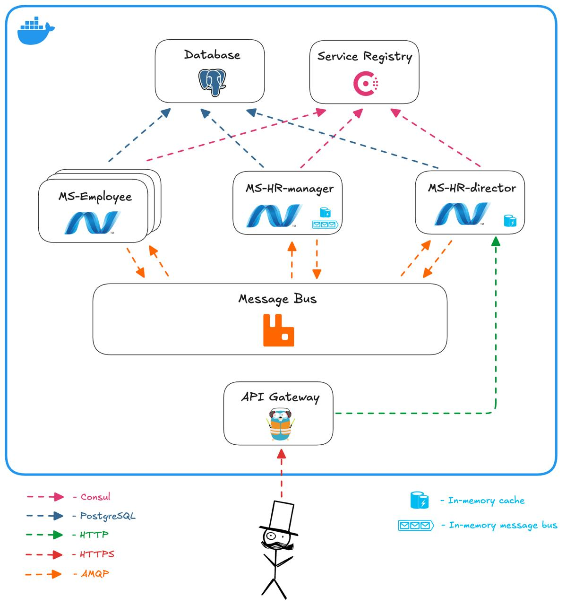

<h1 align="center" style="font-weight: bold;">Dream Team Optimizer</h1>

<p align="center">
    <a href="https://github.com/ptrvsrg/dream-team-optimizer/actions/workflows/build-and-test-dotnet.yml">
        
    </a>
    <a href="https://github.com/ptrvsrg/dream-team-optimizer/graphs/contributors">
        
    </a>
    <a href="https://github.com/ptrvsrg/dream-team-optimizer/forks">
        
    </a>
    <a href="https://github.com/ptrvsrg/dream-team-optimizer/stargazers">
        
    </a>
    <a href="https://github.com/ptrvsrg/dream-team-optimizer/issues">
        
    </a>
    <a href="https://github.com/ptrvsrg/dream-team-optimizer/pulls">
        
    </a>
</p>

<p align="center">The algorithm for forming development teams based on their preferences, in order to maximize harmony and satisfaction of participants.</p>


<h2 id="description">Description</h2>

**The Dream Team Optimizer** project is designed to optimally form development teams based on their preferences gathered
during the hackathon. Each developer (Juniors or TeamLeads) makes a list of desirable colleagues with whom he would like
to work in a team. Based on this data, the project calculates the satisfaction index for each participant, and then
calculates the harmony of the team distribution. The main goal of the project is to maximize the harmony of team
formation in order to ensure the greatest satisfaction of the participants. This tool can be useful for HR professionals
to optimize the process of creating dream teams.

<h2>Strategies</h2>

<h3>Gale–Shapley algorithm</h3>

The strategy is based on the [Gale-Shapley algorithm](https://en.wikipedia.org/wiki/Gale%E2%80%93Shapley_algorithm)
(also known as the deferred acceptance algorithm, the offer and rejection algorithm, or the Boston Pool algorithm). This
algorithm solves the problem of stable matching, which consists in pairing an equal number of participants of two types
using the preferences of each participant.

<h3>Strategy based on bipartite graph</h3>

In order to form teams, a complete weighted bipartite graph is built, such that there are juniors in one share, team
leaders in the other, and the edges have a weight equal to the sum of the vertex satisfaction indices. Next, the edges
are sorted by weight and teams are formed sequentially from the edge with the highest weight (after creating the team,
the corresponding vertices and edges are removed from the rating)

<h3>Weighted preference strategy</h3>

It is a modification of Gale–Shapley algorithm. By introducing weights into preferences, it is possible to balance on 
changing priorities in order to fairly take into account the interests of both sides. For example, if one side prefers 
instinctively, its preferences may carry more weight.

<h3>Comparison</h3>

<details>
  <summary>Machine parameters</summary>

+ **CPU:** AMD Ryzen 5 3500U with Radeon Vega Mobile Gfx
+ **RAM:** DDR4 8GB 3200 MHz * 2

</details>

<table>
    <tr>
        <th>Strategy</th>
        <th>CPU, %</th>
        <th>RAM, %</th>
        <th>Time, s</th>
        <th>Harmonicity</th>
    </tr>
    <tr>
        <td>Gale–Shapley algorithm</td>
        <td>209.667</td>
        <td>0.367</td>
        <td>91</td>
        <td>13.907</td>
    </tr>
    <tr>
        <td>Weighted preference strategy</td>
        <td>317</td>
        <td>0.367</td>
        <td>120</td>
        <td>14.157</td>
    </tr>
    <tr>
        <td>Strategy based on bipartite graph</td>
        <td>369.583</td>
        <td>0.375</td>
        <td>129</td>
        <td>14.159</td>
    </tr>
</table>

<h2 id="technologies">Technologies</h2>

+ .NET SDK 8.0

<h2 id="architecture">Architecture WEB application</h2>



<h2 id="started">Getting started</h2>

<h3>Prerequisites</h3>

- Git
- .NET SDK
- Docker
- Docker Compose

<h3>Installation</h3>

```shell
git clone https://github.com/ptrvsrg/dream-team-optimizer
```

<h3>Launch console application</h3>

Conduct hackathon:
```bash
make build.console
HACKATHON_CONFIG_PATH=./src/DreamTeamOptimizer.ConsoleApp/appsettings.json \
  dotnet ./out/DreamTeamOptimizer.ConsoleApp.dll conduct
```

Print statistic after hackathon by ID:
```bash
make build.console
HACKATHON_CONFIG_PATH=./src/DreamTeamOptimizer.ConsoleApp/appsettings.json \
  dotnet ./out/DreamTeamOptimizer.ConsoleApp.dll stat <ID>
```

Print average harmonicity:
```bash
make build.console
HACKATHON_CONFIG_PATH=./src/DreamTeamOptimizer.ConsoleApp/appsettings.json \
  dotnet ./out/DreamTeamOptimizer.ConsoleApp.dll average-harmonic
```

<h3>Launch WEB application</h3>

1) Build applications

    ```bash
    make build.ms-employee
    make build.ms-hr-director
    make build.ms-hr-manager
    ```

2) Run applications

    ```bash
    docker compose up -d
    ```
    
    After finishing execution, you can see the running containers:
    
    + PostgreSQL - for store data
    + Consul - for service discovery
    + Nginx - for reverse proxy
    + Microservices:
        + ms-employee-1 - WEB application for junior with ID 1
        + ms-employee-21 - WEB application for team lead with ID 21
        + ms-hr-director - WEB application for HR director
        + ms-hr-manager - WEB application for HR manager

3) Conduct hackathon:

    ```bash
    curl -X 'POST' \
      'http://localhost:20080/api/v1/hackathons' \
      -H 'accept: application/json' \
      -d ''
    ```

4) Get hackathon by ID:

    ```bash
    HACKATHON_ID=1
    curl -X 'GET' \
      "http://localhost:20080/api/v1/hackathons/${HACKATHON_ID}" \
      -H 'accept: application/json'
    ```

5) Get average harmonicity:

    ```bash
    curl -X 'GET' \
      'http://localhost:20080/api/v1/hackathons/average-harmonic' \
      -H 'accept: application/json'
    ```

<h2 id="contribute">Contribute</h2>

See in the [CONTRIBUTING.md](CONTRIBUTING.md)

<h2 id="contribute">Code of conduct</h2>

See in the [CODE_OF_CONDUCT.md](CODE_OF_CONDUCT.md)

<h2 id="license">License</h2>

Distributed under the Apache License 2.0 License.
See [Apache License 2.0 License](https://www.apache.org/licenses/LICENSE-2.0) for more information.
